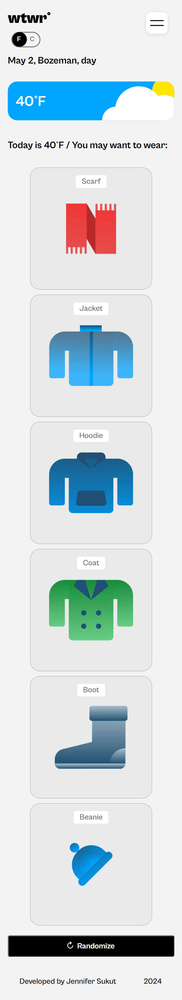

# WTWR (What to Wear?)

## About the project

The idea of the application is pretty simple - we make a call to an API, which then responds with the daily weather forecast. We collect the weather data, process it, and then based on the forecast, we recommend suitable clothing to the user. We have an integration for the time of day, place, and current temperature to choose the best category of clothing for our users. To get the initial layout and design, we utilized React.js and CSS. We have a responsive design that works well on phones and desktops alike! We utilize some of the best parts of React with it's states, hooks, and contexts. We work with API calls and we have also created a JSON server and React Router to keep all our information stored and navitation in place.

## Images & Screenshots

 // 

## Links

- [Figma Design](https://www.figma.com/file/DTojSwldenF9UPKQZd6RRb/Sprint-10%3A-WTWR)
